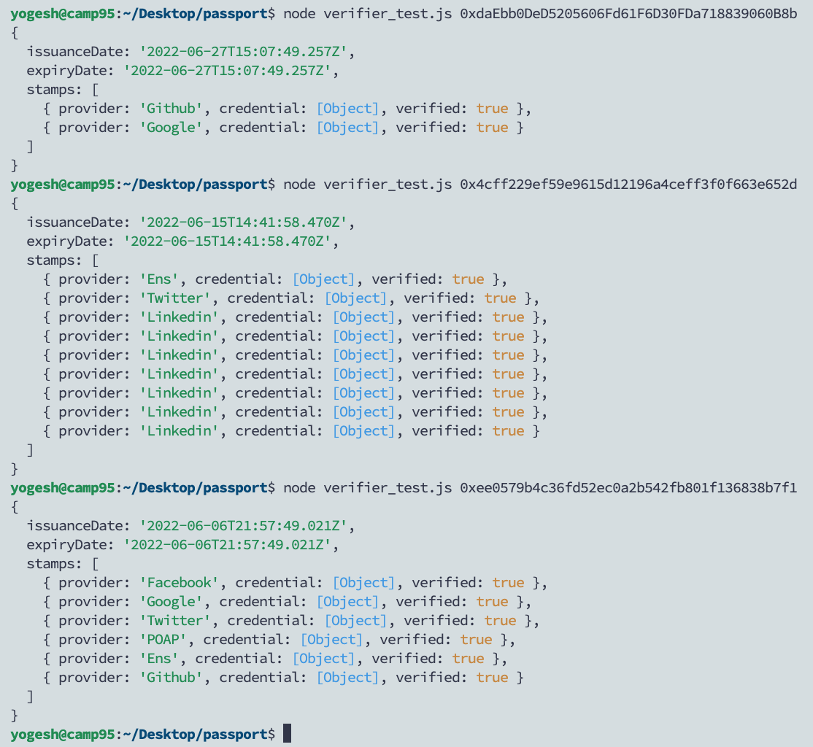
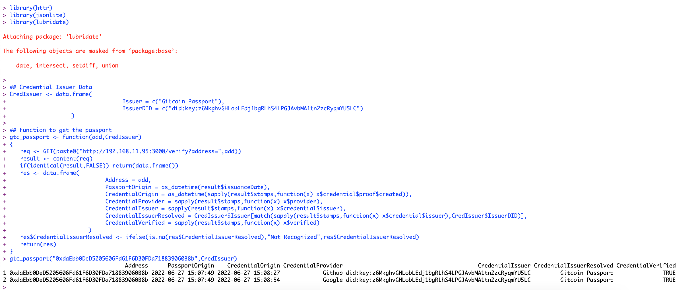

# Passport-Stamp-Query-API

NodeJS API to interact with Gitcoin Passport Data 

### Requirements
- [Install latest NodeJS](https://nodejs.org/en/) Tested with v16.15.1 and higher
- [Install latest yarn](https://classic.yarnpkg.com/lang/en/docs/install) Tested with 1.22.19 and higher

### Installation Steps
- Clone this repo 
- Enter into the repo directory
- Run `./install.sh`
- Start the API using `./startAPI.sh`
- Test the API by visiting 
	`http://127.0.0.1:3000/verify?address=0x4cff229ef59e9615d12196a4ceff3f0f663e652d`
- You can also suply a ceramic node URL (Optional) 
	`http://127.0.0.1:3000/verify?address=0x4cff229ef59e9615d12196a4ceff3f0f663e652d&node=https://ceramic.passport-iam.gitcoin.co`

### R Client
The R code to use the API and get the passport data in a nice and clean format can be found in `consumeAPI.R`

- `Calling API from Web Browser`

- `Testing API using a JS Script`

- `Using example R code to use the API and get data in a clean format`

