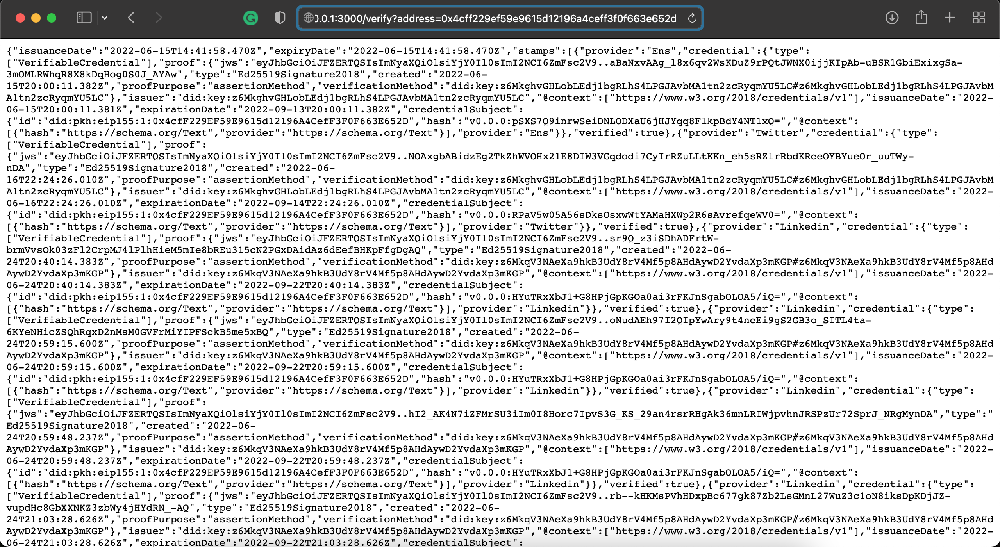

# Passport-Stamp-Query-API

NodeJS API to interact with Gitcoin Passport Data 

### Requirements
- [Install latest NodeJS](https://nodejs.org/en/) Tested with v16.15.1 and higher
- [Install latest yarn](https://classic.yarnpkg.com/lang/en/docs/install) Tested with 1.22.19 and higher

### Installation Steps
- Clone this repo 
- Enter into the repo directory
- Run `./install.sh`
- Start the API using `./startAPI.sh`
- Test the API by visiting
	`http://127.0.0.1:3000/verify?address=0x4cff229ef59e9615d12196a4ceff3f0f663e652d`
- You can also suply a ceramic node URL (Optional)
	`http://127.0.0.1:3000/verify?address=0x4cff229ef59e9615d12196a4ceff3f0f663e652d&node=https://ceramic.passport-iam.gitcoin.co`

